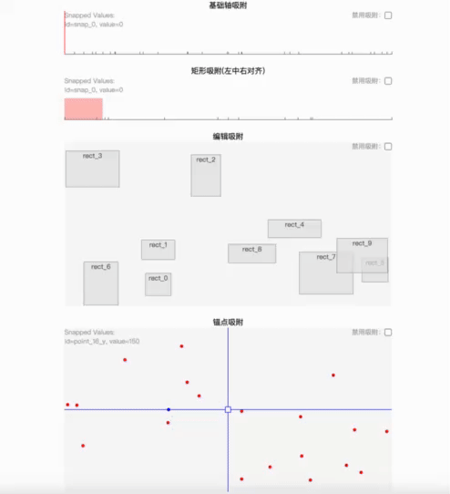

# SnapAxis

SnapAxis 是一个用于管理吸附轴（如水平轴或垂直轴）的类，支持吸附点的添加、删除、更新以及吸附逻辑的实现。



## 安装

使用 npm 或 yarn 安装：

```sh
npm install snap-axis
```

或

```sh
yarn add snap-axis
```

## 使用示例

```ts
import { SnapAxis } from "snap-axis";

const snapAxis = new SnapAxis({
  snapValues: [
    { value: 10, id: "10" },
    { value: 20, id: "20" },
    { value: 30, id: "30" },
  ],
});

let startPageX = 0;
let result;
const updater = snapAxis.getSnapGroupUpdater([3, 30, 50], startPageX, { distance: 5 });

startPageX++;
result = updater(startPageX);
console.log(result); // { values: [4,31,51], snapped: false }

startPageX++;
result = updater(startPageX);
console.log(result); // { values: [10,37,57], snapped: true }

startPageX++;
result = updater(startPageX);
console.log(result); // { values: [10,37,57], snapped: false }

// ...

```

## API 示例

### getSnapUpdater 吸附更新器

```ts
const snapAxis = new SnapAxis({
  snapValues: [
    { value: 10, id: "10" },
    { value: 20, id: "20" },
    { value: 30, id: "30" },
  ],
});
let pageX = 1;
const updater = snapAxis.getSnapUpdater(8, pageX);
pageX++;
const result = updater(pageX);
console.log(result); // { value: 10, snapped: true }

pageX++;
const result = updater(pageX);
console.log(result); // { value: 10, snapped: false }
```

### getSnapGroupUpdater 吸附组更新器

```ts
const snapAxis = new SnapAxis({
  snapValues: [
    { value: 10, id: "10" },
    { value: 20, id: "20" },
    { value: 30, id: "30" },
  ],
});
const updater = snapAxis.getSnapGroupUpdater([10, 20], 0);
const result = updater(1);
console.log(result); // { values: [10, 20], snapped: false }
```

### 添加吸附点

```ts
const snapAxis = new SnapAxis();
snapAxis.addSnapValue({ value: 10, id: "10" });
snapAxis.addSnapValue({ value: 20, id: "20" });
snapAxis.addSnapValue({ value: 30, id: "30" });
```

### updateSnapValue 更新吸附点

```ts
snapAxis.updateSnapValue({ value: 25, id: "20" });
```

### deleteSnapValue 删除吸附点

```ts
snapAxis.deleteSnapValue({ value: 25, id: "20" });
```

### addSnapValues 批量添加吸附点

```ts
const snapAxis = new SnapAxis();
const snapValues = [
  { value: 10, id: "10" },
  { value: 20, id: "20" },
  { value: 30, id: "30" },
];
snapAxis.addSnapValues(snapValues);
```

### deleteSnapValues 批量删除吸附点

```ts
const snapAxis = new SnapAxis();
const snapValues = [
  { value: 10, id: "10" },
  { value: 20, id: "20" },
  { value: 30, id: "30" },
];
snapAxis.addSnapValues(snapValues);
snapAxis.deleteSnapValues(snapValues);
```

### deleteSnapValueById 根据 ID 删除吸附点

```ts
const snapAxis = new SnapAxis();
snapAxis.addSnapValue({ value: 10, id: "10" });
snapAxis.deleteSnapValueById("10");
```

### deleteSnapValueByIds 批量根据 ID 删除吸附点

```ts
const snapAxis = new SnapAxis();
const snapValues = [
  { value: 10, id: "10" },
  { value: 20, id: "20" },
  { value: 30, id: "30" },
];
snapAxis.addSnapValues(snapValues);
snapAxis.deleteSnapValueByIds(["10", "20", "30"]);
```

### getSnapValues 获取所有吸附点

```ts
const snapValues = snapAxis.getSnapValues();
console.log(snapValues); // [{ value: 10, id: "10" }, { value: 30, id: "30" }]
```

### getSnappedValues 给定轴的某个值，匹配该轴对应的所有吸附点。

```ts
snapAxis.deleteSnapValue({ value: 10, id: "A" });
snapAxis.deleteSnapValue({ value: 10, id: "B" });
const snappedValues = snapAxis.getSnappedValues(10);
console.log(snappedValues); // [{ value: 10, id: "A" },{ value: 10, id: "B" }]
```

### snapToNearest 吸附到最近的吸附点

```ts
const result = snapAxis.snapToNearest(18);
console.log(result); // { snapped: true, value: 20 }
console.log(snapAxis.getSnappedValues(result.value)); // [...]
```

### snapToPrev 吸附到上一个吸附点

```ts
const snapAxis = new SnapAxis({
  snapValues: [
    { value: 10, id: "10" },
    { value: 20, id: "20" },
    { value: 30, id: "30" },
  ],
});
const result = snapAxis.snapToPrev(25);
console.log(result); // { snapped: true, value: 20 }
```

### snapToNext 吸附到下一个吸附点

```ts
const snapAxis = new SnapAxis({
  snapValues: [
    { value: 10, id: "10" },
    { value: 20, id: "20" },
    { value: 30, id: "30" },
  ],
});
const result = snapAxis.snapToNext(15);
console.log(result); // { snapped: true, value: 20 }
```

### snapToNearest 吸附到最近的吸附点（带方向）

```ts
const snapAxis = new SnapAxis({
  snapValues: [
    { value: 10, id: "10" },
    { value: 20, id: "20" },
    { value: 30, id: "30" },
  ],
});
const result = snapAxis.snapToNearest(18, { direction: SnapDirection.PREV });
console.log(result); // { snapped: true, value: 10 }
```

### snapToNearestIfNeeded 吸附到最近的吸附点（如果需要）

```ts
const snapAxis = new SnapAxis({
  snapValues: [
    { value: 10, id: "10" },
    { value: 20, id: "20" },
    { value: 30, id: "30" },
  ],
});
const result = snapAxis.snapToNearestIfNeeded(18);
console.log(result); // { snapped: true, value: 20 }

const result = snapAxis.snapToNearestIfNeeded(10); // 已经处于吸附状态
console.log(result); // { snapped: false, value: 10 }
```

### snapGroupToNearest 吸附到最近的吸附点组

```ts
const snapAxis = new SnapAxis({
  snapValues: [
    { value: 10, id: "10" },
    { value: 20, id: "20" },
    { value: 30, id: "30" },
  ],
});
const result = snapAxis.snapGroupToNearest([18, 25]);
console.log(result); // { snapped: true, values: [20, 27] }
```

### snapGroupToNearestIfNeeded 吸附到最近的吸附点组（如果需要）

```ts
const snapAxis = new SnapAxis({
  snapValues: [
    { value: 10, id: "10" },
    { value: 20, id: "20" },
    { value: 30, id: "30" },
  ],
});
const result = snapAxis.snapGroupToNearestIfNeeded([18, 25]);
console.log(result); // { snapped: true, values: [20, 27] }
```

## 接口定义

```typescript
interface ISnapValue {
  id: string | number;
  value: number;
  [x: string | number]: any;
}

interface SnapAxisOptions {
  snapValues?: ISnapValue[];
  debug?: boolean;
  getSnapUnitValue?: () => number;
}

enum SnapDirection {
  PREV = 0,
  NEXT = 1,
  BOTH = 2,
}

interface SnapToNearestOptions {
  direction?: SnapDirection;
  distance?: number;
}

interface SnapToNearestResult {
  snapped: boolean;
  value: number;
}

interface SnapToResult {
  snapped: boolean;
  value: number;
}

interface SnapGroupToResults {
  snapped: boolean;
  values: number[];
}

interface SnapUpdaterOptions {
  distance?: number;
  scale?: number;
  disableSnap?: boolean;
}
```

## 类定义

```typescript
class SnapAxis {
  constructor(options?: SnapAxisOptions);

  has(id: ISnapValue["id"]): boolean;
  hasValue(value: ISnapValue["value"]): boolean;
  addSnapValue(snapValue: ISnapValue): void;
  updateSnapValue(snapValue: ISnapValue): boolean;
  addSnapValues(snapValues: ISnapValue[]): void;
  deleteSnapValue(snapValue: ISnapValue): boolean;
  deleteSnapValueById(id: ISnapValue["id"]): boolean;
  deleteSnapValues(snapValues: ISnapValue[]): void;
  deleteSnapValueByIds(ids: ISnapValue["id"][]): void;
  checkSnapped(value: number): boolean;
  snapTo(axisValue: number, offset: number, options: { distance: number }): SnapToResult;
  snapGroupTo(
    axisValues: number[],
    offset: number,
    options: { distance: number }
  ): SnapGroupToResults;
  getSnappedValues(value: number): ISnapValue[];
  getSnapValues(): ISnapValue[];
  snapToNearest(value: number, options?: SnapToNearestOptions): SnapToNearestResult;
  snapGroupToNearest(values: number[], options?: SnapToNearestOptions): SnapGroupToResults;
  snapToNearestIfNeeded(value: number, options?: SnapToNearestOptions): SnapToNearestResult;
  snapGroupToNearestIfNeeded(values: number[], options?: SnapToNearestOptions): SnapGroupToResults;
  snapToPrev(value: number, options?: Omit<SnapToNearestOptions, "direction">): SnapToNearestResult;
  snapGroupToPrev(
    values: number[],
    options?: Omit<SnapToNearestOptions, "direction">
  ): SnapGroupToResults;
  snapToNext(value: number, options?: Omit<SnapToNearestOptions, "direction">): SnapToNearestResult;
  snapGroupToNext(
    values: number[],
    options?: Omit<SnapToNearestOptions, "direction">
  ): SnapGroupToResults;
  getSnapGroupUpdater(
    initValues: number[],
    startAxisValue: number,
    options?: SnapUpdaterOptions
  ): (currentAxisValue: number, options?: SnapUpdaterOptions) => SnapGroupToResults;
  getSnapUpdater(
    initValue: number,
    startAxisValue: number,
    options?: SnapUpdaterOptions
  ): (currentAxisValue: number, options?: SnapUpdaterOptions) => SnapToResult;
}
```

## 相关
- [refline.js](https://github.com/refline/refline.js)
